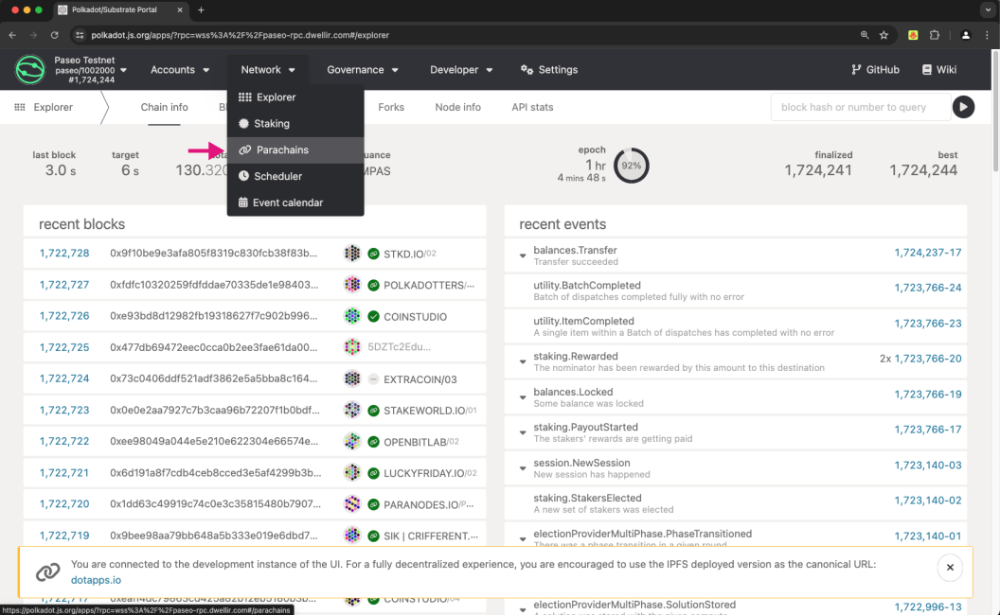
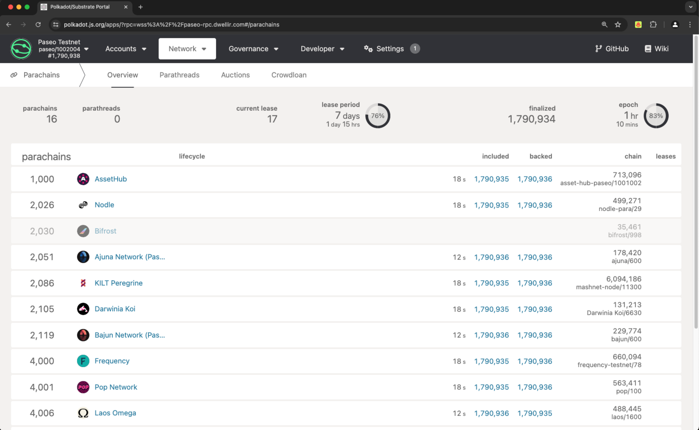
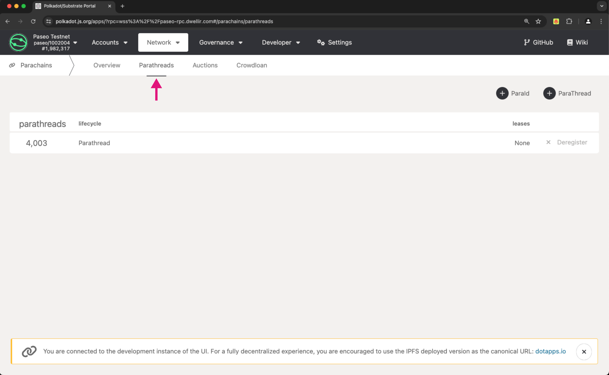
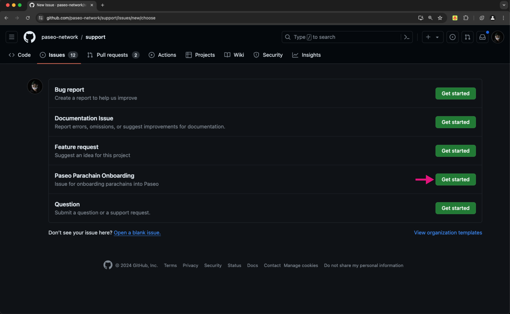
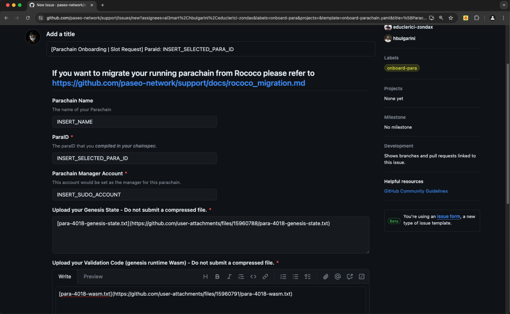

# Deploying a Parachain on Paseo Testnet

Paseo is a community run testnet designed for parachain teams and dApp developers to build and test their solutions. The Paseo network is open, allowing anyone to launch an appchain (parachain) as part of their process for eventual deployment onto the Polkadot mainnet.

- Maintainers of live parachains on the Polkadot or Kusama mainnets will be granted a dedicated Paseo parachain slot for a one year lease period.

- Maintainers of parachains under active development, or those that have not yet secured a parachain slot on Kusama or Polkadot, will be assigned a shorter Paseo lease period of two weeks.

This guide will walk you through the process of deploying your blockchain as a parachain on the Paseo testnet. We'll cover reserving a ParaId, generating a customized chainspec, registering a parathread, securing a dedicated parachain slot, and finally, setting up and running your parachain.

## Prerequisites

Before you can deploy your parachain on the Paseo testnet, you'll need to meet the following requirements:

[//]: <> (//TODO: Add links to the following items)

- [Wallet](): a Substrate-supported wallet to deploy and manage your parachain.
- [PAS Tokens](): the native currency of the Paseo testnet to pay for transaction fees.
- [Parachain Runtime](): a fully operational blockchain capable of operating as a parachain.

## Reserve a ParaId

To deploy your parachain, you'll first need to reserve a unique ParaId on the Paseo testnet.

1. Visit [PolkadotJS](https://polkadot.js.org/apps/?rpc=wss%3A%2F%2Fpaseo-rpc.dwellir.com#/explorer){target=_blank} and ensure you're connected to the Paseo testnet.

2. Navigate to the Network > Parachains section.


3. Switch to the Parathreads tab and click the +ParaId button.


4. Submit the transaction and save the assigned ParaId for future reference.


> In this example, the ParaId assigned is 4017

## Generate and Customize the Chainspec

In this guide, the [Generic template](https://github.com/OpenZeppelin/polkadot-runtime-templates/tree/v1.0.0) from [OpenZeppelin Substrate Parachain Runtimes](https://docs.openzeppelin.com/substrate-runtimes/1.0.0/) will be used to quickly bootstrap a Substrate project for the Paseo testnet.

1. Generate a plain chainspec:

```bash
./target/release/parachain-template-node build-spec --disable-default-bootnode > plain-parachain-chainspec.json
```

2. Edit the `plain-parachain-chainspec.json` file:
    - Update the `name`, `id`, and `protocolId` to unique values for your parachain.
    - Change `relay_chain` to `paseo`.
    - Change `para_id` and `parachainInfo.parachainId` from 1000 to the ParaId you reserved in step 1.

    ```json
    {
        "name": "My Parachain Name",
        "id": "my_parachain",
        "chainType": "Local",
        "bootNodes": [],
        "telemetryEndpoints": null,
        "protocolId": "my_para",
        "properties": {
            "ss58Format": 42,
            "tokenDecimals": 12,
            "tokenSymbol": "UNIT"
        },
        "relay_chain": "paseo",
        "para_id": 4017,
        "codeSubstitutes": {},
        "genesis": {
            "runtimeGenesis": {
                "code": "...",
                "patch": {
                    "balances": {...},
                    "collatorSelection": {...},
                    "parachainInfo": {
                        "parachainId": 4017
                    },
                    "polkadotXcm": {
                        "safeXcmVersion": 4
                    },
                    "session": {...},
                    "sudo": {...}
                }
            }
        }
    }
    ```

3. Generate a raw chainspec:

```bash
./target/release/parachain-template-node build-spec --chain plain-parachain-chainspec.json --disable-default-bootnode --raw > raw-parachain-chainspec.json
```

## Register a Parathread

Before securing a dedicated parachain slot, you'll need to register a parathread on the Paseo testnet. 

> Replace `paraId` with the ParaId you reserved earlier in the following commands.

1. Generate a genesis state:

```bash
./target/release/parachain-template-node export-genesis-state --chain raw-parachain-chainspec.json para-<paraId>-genesis-state
```

2. Generate a genesis wasm:

```bash
./target/release/parachain-template-node export-genesis-wasm --chain raw-parachain-chainspec.json para-<paraId>-wasm
```

3. Visit [PolkadotJS](https://polkadot.js.org/apps/?rpc=wss%3A%2F%2Fpaseo-rpc.dwellir.com#/explorer) and navigate to Network > Parachains.


4. Click the +ParaThread button.


5. Submit the generated genesis state and genesis Wasm files.


[//]: <> (//TODO: This last extrinsic is failing with Insufficient balance. Need to investigate further.)

## Obtain a Parachain Slot

To upgrade your parathread to a full parachain, you must secure a dedicated parachain slot.

1. Submit an issue via the [Paseo Support Repository](https://github.com/paseo-network/support) using the [Paseo Parachain Onboarding issue template](https://github.com/paseo-network/support/issues/new/choose).

2. Once your request is reviewed and approved, you'll be allocated a dedicated parachain slot.


## Set Up Your Parachain

With a parachain slot secured, you can now set up and run your parachain on the Paseo testnet.

1. Download the [Paseo Spec](https://github.com/paseo-network/runtimes/blob/main/chain-specs/paseo.raw.json).

2. Start your parachain collator node with the following command:

```bash
./target/release/parachain-template-node \
--alice \
--collator \
--force-authoring \
--chain raw-parachain-chainspec.json \
--base-path ./data \
--port 40333 \
--rpc-port 8845 \
-- \
--execution wasm \
--chain paseo.raw.json \
--port 30343 \
--rpc-port 9977
```

Congratulations! You've successfully deployed your parachain on the Paseo testnet. You can now test and iterate on your blockchain project within the Paseo ecosystem.